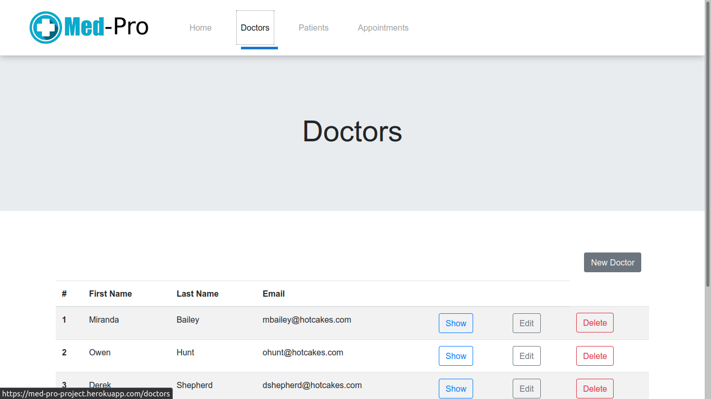

# Med-Pro

It's a real-world-like project, built with business specifications based on an app to book a doctor's appointment. REST API that manages database resources.




## :package: Built With

- HTML and JSX
- CSS
- Javascript (ES6)
- React
- Redux
- Ruby
- Ruby on Rails
- Postgres
- REST API
- npm

## :mag: Live Demo

[Live Demo Link](https://med-pro-project.herokuapp.com/)

## :computer: Getting Started

To get a local copy up and running follow these simple steps.


### Download

1) Clone the repository to your local machine

```sh
  $ git clone https://github.com/mcervantes71/Med-Pro.git
```

2) cd into the directory

```sh
  $ cd Med-Pro
```

### Setup

Install gems with:

```sh
  $ bundle install
```

Install all dependencies:

```sh
  $ yarn install
```

Setup database with:

```sh
  $ rails db:create
  $ rails db:migrate
```

Populating the database with:

```sh
  $ rails db:seed
```

### Usage

run localhost server:

```sh
  $ rails server
```

if presented with and `Error` message similar to this:


Run:

```sh
  $ yarn install --check-files
```

### API Documentation

| Url                   | Method      | Description                    |
| --------------------- | :---------: | -------------------------------|
|/api/doctors/index     |  get        | Show a list of all records     |
|/api/doctors/:id       |  get        | Show a specific record         |
|/api/doctors/create    |  post       | Create a new record            |
|/api/doctors/:id       |  put        | Edit a specific record         |
|/api/doctors/:id       |  delete     | Delete a specific record       |

## :busts_in_silhouette: Authors

👤 **Martin Cervantes**

- Linkedin: [Martin Cervantes](https://www.linkedin.com/in/cervantesmartin/)
- Twitter: [@M4rt1nC3rv4nt3s](https://twitter.com/M4rt1nC3rv4nt3s)
- Github: [@mcervantes71](https://github.com/mcervantes71)
- Gmail: [cervantes.martine](mailto:cervantes.martine@gmail.com)

## 🤝 Contributing

    Contributions, issues and feature requests are welcome!

Feel free to check the [issues page](../../issues).

## :star2: Show your support

    Give a ⭐️ if you like this project!

## 📝 License

This project is [MIT](lic.url) licensed.
